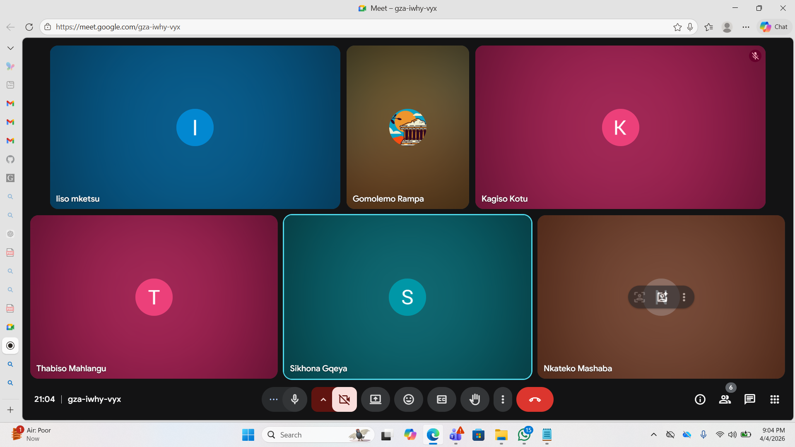

# Scrum 2

# Objectives

1. Finalize user stories for Sprint 2
2. Allocate user stories to team members
3. Set deadlines and agreements

---

## Meet up with Client

The team met online on 15 April to finalize and allocate user stories for Sprint 2. The client was not present at this internal meeting. Each team member selected one user story to work on for Sprint 2. Members will be responsible for both frontend and backend implementation of their chosen user story.

**Deadlines & Agreements:**

- All members must ensure that any issues from Sprint 1 related to their work are fixed
- Previously non-functional features must be corrected
- Deadline: 16 April

---

## Choose Specifications

**Finalized User Stories:**

The team agreed on the following user stories:

| # | Role | User Story |
|---|------|-------------|
| 1 | Admin | As an Admin, I want to view all members in a group so that I can manage them |
| 2 | Member | As a Member, I want to view my profile so that I can see my details |
| 3 | Admin | As an Admin, I want to schedule meetings so that members are informed about upcoming events |
| 4 | Admin | As an Admin, I want to post meeting agendas so that members know what will be discussed |
| 5 | Admin | As an Admin, I want to record meeting minutes so that there is a record of decisions made |
| 6 | Admin | As an Admin, I want to remove member(s) from the group so that I can manage group membership |
| 7 | Member | As a Member, I want to receive notifications so that I stay updated on meetings and activities |

---

## Create Backlog

**Items added to backlog for Sprint 2:**

- View Members (Admin)
- View Profile (Member)
- Schedule Meetings (Admin)
- Post Agendas (Admin)
- Record Meetings (Admin)
- Remove Members (Admin)
- Receive Notifications (Member)

## Evidence

