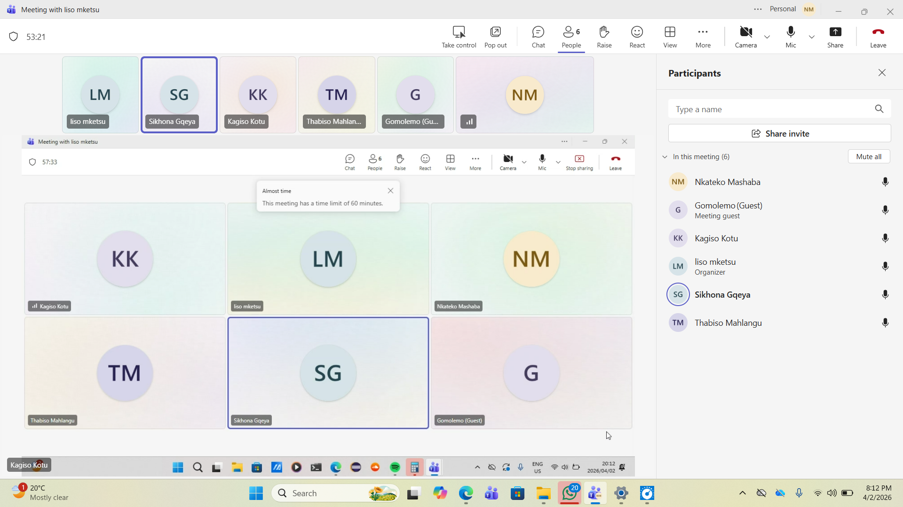

# Scrum 3

# Objectives

1. Review progress on Sprint 2 tasks
2. Address challenges and align on implementation structure
3. Establish communication agreements

---

## Meet up with Client

The team met online on 16 April to review progress on Sprint 2 tasks, address challenges, and align on implementation structure. The client was not present at this internal meeting.

**Progress Update:**

- Each team member shared their current progress on assigned user stories
- General progress was reviewed to ensure alignment with Sprint 2 goals

**System Design Discussion:**

- Discussed how to structure the Admin Dashboard, as most user stories are centered around it
- Agreed on the need for a clear and consistent dashboard structure to support all admin functionalities

---

## Choose Specifications

**Challenges & Solutions:**

Team members discussed issues and challenges they are currently experiencing. The group collaboratively proposed possible solutions.

**Agreements:**

Before pushing any changes to Git:
- Team members must inform the group via WhatsApp

This is to ensure:
- Better coordination
- Avoid conflicts and overwriting work

---

## Create Backlog

**Items added to backlog for Sprint 2:**

- Continue working on assigned user stories
- Address identified issues using discussed solutions
- Follow agreed communication process before pushing code
- Structure Admin Dashboard consistently

## Evidence

