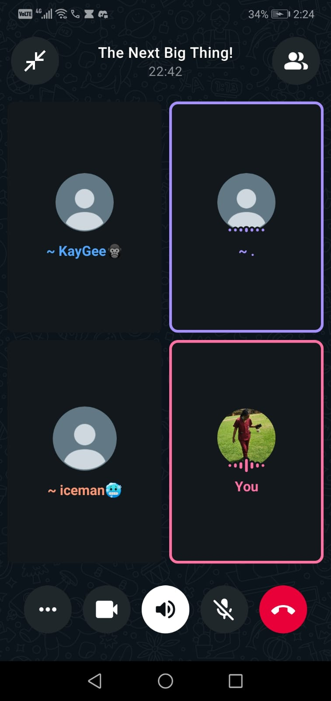

# Scrum 4

# Objectives

1. Review final progress on Sprint 2
2. Address authentication integration challenges
3. Align on completion deadlines

---

## Meet up with Client

The team met online on 17 April 2026 to review final progress on Sprint 2 and align on completion deadlines. The client was not present at this internal meeting.

**Progress Update:**

- Team members shared their current progress on Sprint 2 user stories
- Overall, minimal discussion as most members were continuing with implementation

**Key Discussion:**

A team member reported challenges with:
- Integrating third-party authentication
- Specifically, handling password storage for manual login alongside third-party login

The team discussed possible approaches to resolve this issue.

---

## Choose Specifications

**Deadlines:**

The team agreed that:
- All members must complete Sprint 2 user story implementation
- Deadline: Sunday morning

**User Stories Summary:**

| # | Role | User Story |
|---|------|-------------|
| 1 | Admin | View all members in a group |
| 2 | Member | View my profile |
| 3 | Admin | Schedule meetings |
| 4 | Admin | Post meeting agendas |
| 5 | Admin | Record meeting minutes |
| 6 | Admin | Remove member(s) from the group |
| 7 | Member | Receive notifications |

---

## Create Backlog

**Items added to backlog for Sprint 2:**

- Finalize all user stories before Sunday morning deadline
- Resolve third-party authentication integration issues
- Handle password storage for manual login alongside third-party login

## Evidence

